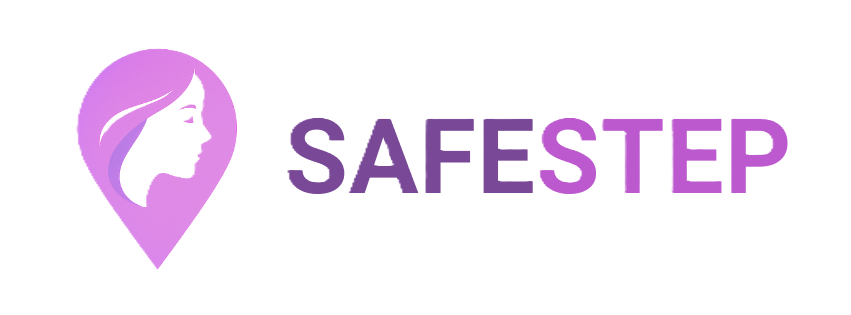
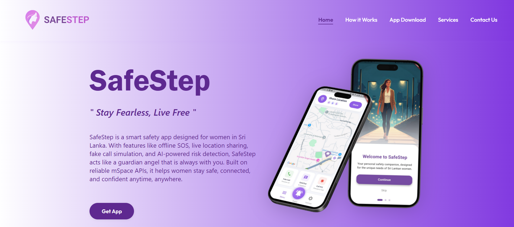
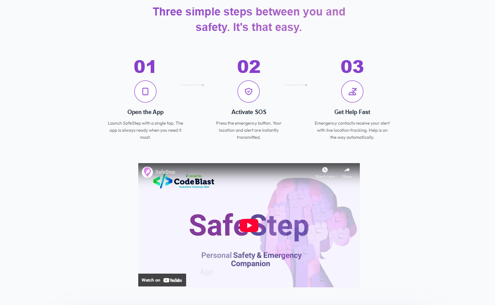
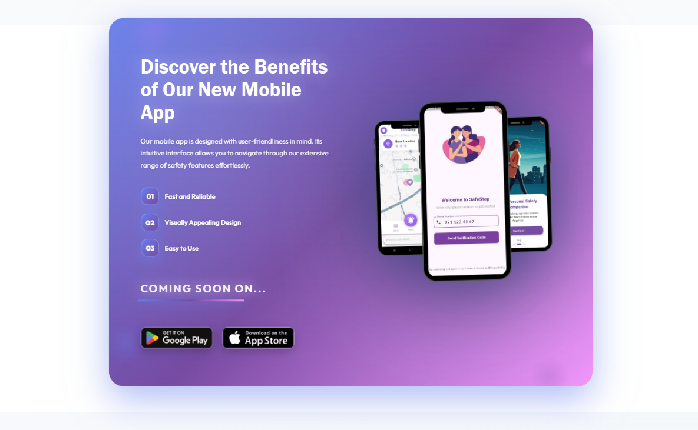
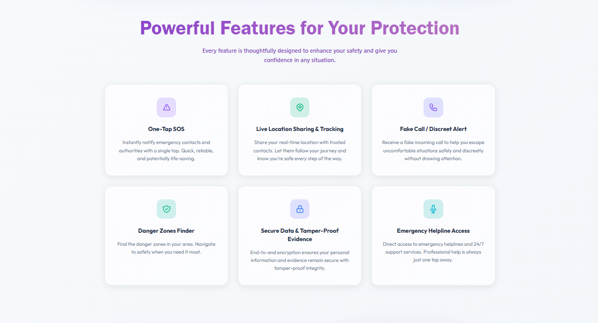
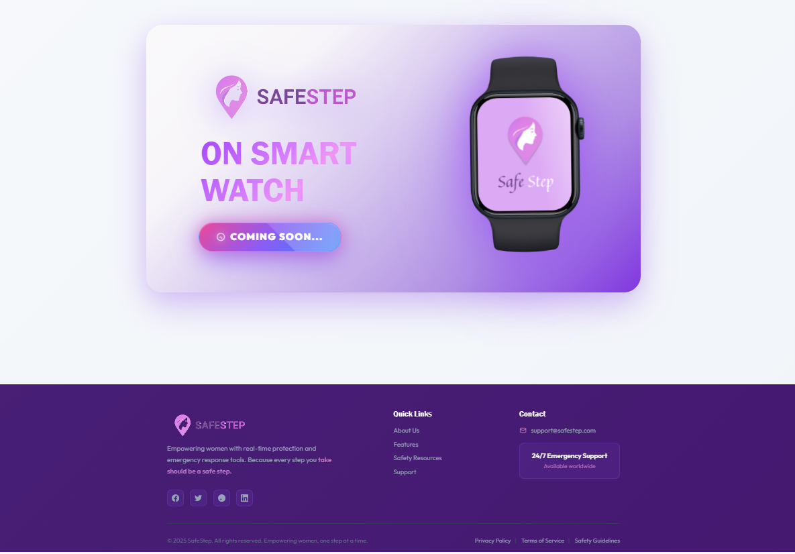

# 🛡️ SafeStep – Stay Safe, Live Free

> **Empowering Women with Real-Time Protection, Safety, and Support.**



---

**Official Introduction Website for the SafeStep App**  
💜 *Learn about our personal safety app, explore features, and get empowered.*

---

## 🚀 Key Features

- 🌐 **Modern Responsive Design** – Works seamlessly on desktop, tablet, and mobile browsers.  
- 📖 **Feature Highlights** – Explains SOS alerts, real-time location sharing, fake call, and community safety.  
- 🎨 **Interactive UI/UX** – Attractive visuals and smooth animations for better engagement.  

---

## 💻 Tech Stack

**React.js + Vite + CSS3** – modern frontend framework and build tool with styling.

---

## 📡 Links

- **SafeStep Mobile App GitHub**: [https://github.com/budd9442/SafeStep](https://github.com/budd9442/SafeStep)  
- **Demo Video on YouTube**: [https://www.youtube.com/embed/9OXSl0eOqj8](https://www.youtube.com/embed/9OXSl0eOqj8)  

---

## 📲 Screenshots
<table>
  <tr>
    <td>
      <figure>
        
      </figure>
    </td>
    <td>
      <figure>
        
      </figure>
    </td>
    <td>
      <figure>
        
      </figure>
    </td>
  </tr>
  <tr>
    <td>
      <figure>
        
      </figure>
    </td>
    <td>
      <figure>
        
      </figure>
    </td>
  </tr>
</table>

---

## ⚙️ Setup & Deployment

1. **Clone the Repository**
   ```bash
   git clone https://github.com/ThasuniInduma/safestep.git
   cd safestep-web
   ```
2. **Install Dependencies**
   ```bash
   npm install
   ```
3. **Run Locally**
   ```bash
   npm run dev
   ```
4. **Deploy on Netlify**

---

SafeStep Web is the gateway to understanding our app, highlighting personal safety features, team efforts, and empowering users to take control of their safety.

# 💜 Team DevMates 💜

